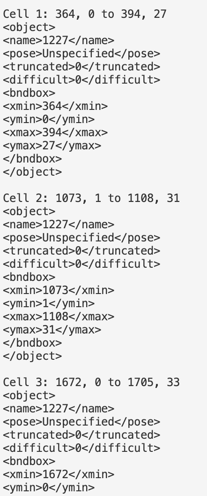

# Detection of Acute Myeloid Leukemia (AML) Cells in Patient-Derived Microscopy Samples
Cells are the fundamental biological units, and identifying specific cell types—such as cancerous or immune cells—is critical for disease diagnosis and treatment. Traditional methods rely on manual thresholding of fluorescence markers to differentiate cells from debris and to classify cancer and immune cells, which is time-consuming and patient-specific.

Our dataset consists of microscopy images with six fluorescence channels representing different markers:
- Channel 1: DIC (differential interference contrast)
- Channel 2: CD33 (marker for Acute Myeloid Leukemia cancer cells)
- Channel 3: Ki67 (proliferation marker)
- Channel 4: PARP (apoptosis marker)
- Channel 5: CD3 (immune cell marker)
- Channel 6: Nucleus

Current approaches use fixed pixel thresholds around nuclei and manual fluorescence cutoffs, requiring human tuning per patient sample. This limits scalability and accuracy. We apply machine learning, specifically RetinaNet with a TensorFlow/Keras backend, for automated detection and classification of AML (CD33+) cancer cells and immune cells (CD3+). RetinaNet’s one-stage object detection architecture efficiently handles dense, small objects like cells. Training data is sourced from Oregon Health and Science University.

This approach automates and accelerates cell identification, surpassing manual methods in speed and accuracy, enabling scalable analysis and improved cancer research workflows.

## Dataviewer

  
  

## XML Generator

  

