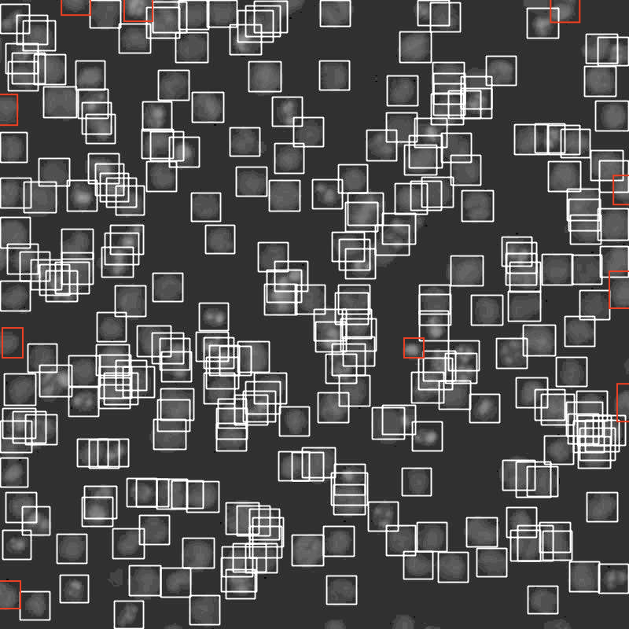

# Detection of Acute Myeloid Leukemia (AML) Cells in Patient-Derived Microscopy Samples
Traditional cell identification in AML diagnostics relies on manual / hard-coded methods, including fixed pixel distances from nuclei and thresholds for fluorescence intensity. This process is not only time-intensive but also highly variable across patients, making it difficult to generalize and prone to inconsistent results.

To address these challenges and improve scalability, we present an automated ID approach using RetinaNet, a one-stage object detection model implemented with TensorFlow/Keras, to detect and classify acute myeloid leukemia (AML) cells expressing CD33 and immune cells expressing CD3. RetinaNet’s architecture is well-suited for this task due to its ability to accurately detect small, densely packed objects, such as cells, within complex biological imagery.

  

This deep learning-based solution streamlines the identification process, significantly reducing the need for manual intervention while improving both accuracy and throughput. By automating cell classification, our method enables scalable, high-fidelity analysis via computer vision, contributing to more efficient AML diagnostics and research workflows.

## Dataset

We formatted our dataset using the Pascal VOC 2007 structure, which includes three key components: 
1. **JPEGImages/**: Contains microscopy images (800×800 resolution) of annotated clinical samples at Oregon Health & Science University, preprocessed across six fluorescence channels (see `cell_JPG_images`).
- Channel 1: DIC (differential interference contrast)
- Channel 2: CD33 (marker for Acute Myeloid Leukemia cancer cells)
- Channel 3: Ki67 (nuclear protein marker associated with cellular proliferation)
- Channel 4: PARP (apoptosis marker)
- Channel 5: CD3 (T-cell marker for immune cells)
- Channel 6: Nucleus (nuclear stain)
2. **Annotations/**: Contains .xml files generated from cell segmentation masks (see `cell_annotation_generator.py`) and validated CD33+/CD3+ cell ID lists.
  
3. **ImageSets/**: Includes `train.txt`, `val.txt`, and `trainval.txt`, listing image filenames (without extensions) for training and validation splits with no overlap.

**Gold Standard**
The ground truth was based on experimentally validated CD33+ and CD3+ cell ID lists provided by OHSU, serving as the gold standard control. These IDs were mapped back to their spatial locations in the segmentation masks to generate accurate training labels (see `cell_mask_visualizer.py`).

## Dataviewer
This Streamlit app provides an interactive visualization of patient-derived microscopy samples by displaying TWO selected fluorescence channels from cellular imaging data. 

Users select a sample folder and pick two fluorescence channel images for side-by-side comparison. Each channel’s image is enhanced with an adjustable brightness multiplier to improve feature visibility / contrast. Additionally, it loads and displays the corresponding cell segmentation ground truth from a CSV file as a grayscale reference image.

  
  

^As seen on the right, the app creates a composite overlay of the brightened channels, highlighting colocalized regions in yellow.

## Annotation Generator (xml)
This Python script processes cell segmentation data and generates XML annotations for cancer cells (specifically CD33+ cells) in a format compatible with object detection frameworks (e.g., Pascal VOC format). It reads:
- Cell mask CSV files that contain labeled cell regions as integers (each integer corresponds to a cell ID).
- CSV listing of which cells are cancer-positive.
For each cell, the script calculates bounding boxes (smallest and largest X and Y coordinates where the cell appears in the mask), applies some position corrections, checks if the cell is cancer-positive, and writes XML annotation files describing bounding boxes of the cancer cells for training.
